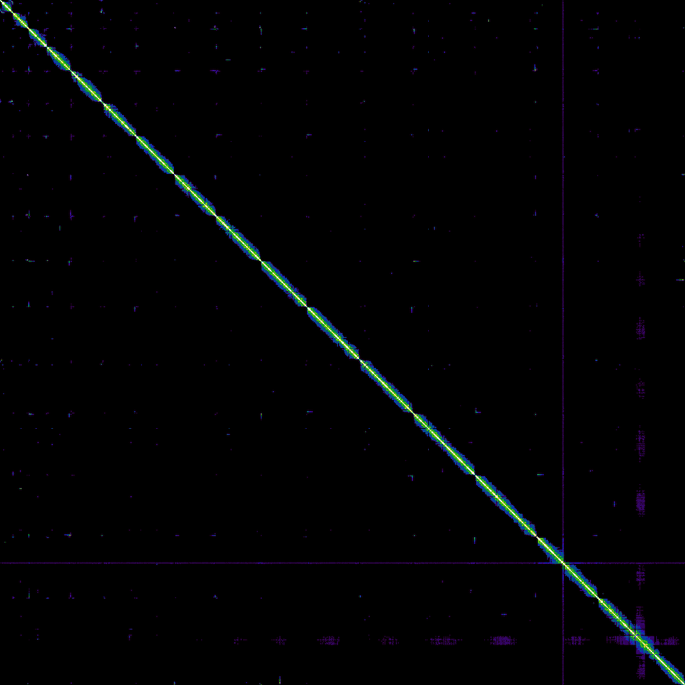
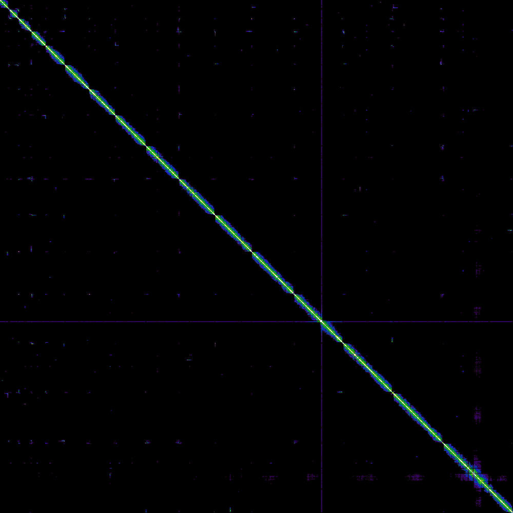

# Diploid Genome Assembly of *Saccharomyces cerevisiae* using Hi-C Scaffolding

**Author:** Asim Ahmed
**Institution:** National University of Sciences and Technology (NUST) — SINES
**Program:** BS Bioinformatics

---

## Project Overview

This project follows the [Vertebrate Genomes Project (VGP) assembly pipeline](https://training.galaxyproject.org/training-material/topics/assembly/tutorials/vgp_genome_assembly/tutorial.html) from the Galaxy Training Network, applied to *Saccharomyces cerevisiae* (baker's yeast) as a test organism. The yeast genome (~12 Mb, 16 chromosomes) serves as a practical, computationally lightweight model for learning and validating the full VGP workflow before scaling to larger vertebrate genomes.

Because *S. cerevisiae* is diploid, both haplotypes were assembled independently to avoid collapsing parental sequences into a single chimeric representation. The key technology enabling chromosome-level scaffolding is **Hi-C sequencing**, which captures chromatin conformation — the physical proximity of DNA segments inside the nucleus. By analyzing which contigs share dense 3D contact signals, we infer their linear adjacency on a chromosome and scaffold them accordingly.

---

## Datasets

| Dataset | Description |
|:---|:---|
| `HiFi_synthetic_50x_01/02/03.fasta` | PacBio HiFi contigs (high-accuracy, long-read) |
| `SRR7126301_1/2.fastq.gz` | Illumina Hi-C paired-end reads (forward and reverse) |
| `Hi-C_dataset_F`, `Hi-C_dataset_R` | Additional Hi-C read pairs for scaffolding |
| `bionano.cmap` | Bionano optical map for hybrid scaffolding |

---

## Pipeline

The full workflow was built and executed on the [Galaxy](https://usegalaxy.org/) platform. The exported `.ga` file is included in this repository for direct import and reproduction.

### 1. Contig Assembly — HiFiASM

Raw HiFi reads were assembled into phased contigs using **HiFiASM** (v0.25.0), which natively resolves haplotypes using Hi-C phasing information. The two output GFA graphs (one per haplotype) were converted to FASTA with **gfa_to_fa**.

### 2. K-mer Profiling and QC — Meryl + GenomeScope + Merqury

**Meryl** (v1.3) built a k-mer database from Illumina short reads, which served two purposes:

- **GenomeScope** (v2.1) used the k-mer frequency spectrum to estimate genome size, heterozygosity, and repeat content.
- **Merqury** (v1.3) evaluated assembly completeness and per-base accuracy (QV) by comparing the assembly's k-mer content against the read-derived truth set.

### 3. Read QC — Cutadapt

Hi-C reads were adapter-trimmed with **Cutadapt** (v5.2) prior to alignment to remove sequencing artifacts that would otherwise produce spurious contact signals.

### 4. Hybrid Scaffolding — Bionano

**Bionano Solve** (v3.7.0) integrated the optical map (`bionano.cmap`) with HiFiASM contigs to resolve large-scale structural ambiguities before Hi-C scaffolding. This was performed independently for both haplotypes.

### 5. Hi-C Scaffolding — BWA-MEM2 + Bellerophon + YAHS

For each haplotype:

1. **BWA-MEM2** (v2.3) aligned Hi-C read pairs to the Bionano-scaffolded assembly.
2. **Bellerophon** (v1.0) filtered chimeric Hi-C read pairs that span ligation junctions — these would otherwise introduce false long-range contacts.
3. **YAHS** (v1.2a.2) consumed the filtered alignments and iteratively joined contigs into chromosome-level scaffolds based on contact frequency.

### 6. Evaluation

| Tool | Purpose |
|:---|:---|
| **Fasta Statistics** | N50, total length, scaffold count |
| **BUSCO** (v5.8.0) | Gene-space completeness (vertebrata_odb12 — see note in Results) |
| **PretextMap + PretextSnapshot** | Hi-C contact matrix visualization |

---

## Genome Profiling

### K-mer Analysis — GenomeScope

GenomeScope estimated genome properties from the k-mer frequency spectrum (k=31, ploidy=2). The two peaks at ~25x and ~50x coverage correspond to the heterozygous and homozygous k-mer components, confirming diploidy.


| Parameter | Value |
|:---|:---|
| **Estimated genome size** | 11,743,432 bp |
| **Unique sequence** | 93.8% |
| **Homozygosity (aa)** | 99.4% |
| **Heterozygosity (ab)** | 0.58% |
| **K-mer coverage** | 25x |
| **Error rate** | 0.000943% |
| **Duplication rate** | 4.98% |

### Assembly QC — Merqury

Merqury assessed per-base accuracy (QV) and k-mer completeness by comparing assembly k-mers against the read-derived truth set.

| Assembly | Error K-mers | Total K-mers | QV | Error Rate |
|:---|:---|:---|:---|:---|
| **Haplotype 1** | 4 | 12,160,478 | 79.74 | 1.06 × 10⁻⁸ |
| **Haplotype 2** | 0 | 11,304,102 | ∞ (perfect) | 0 |
| **Combined** | 4 | 23,464,580 | 82.60 | 5.50 × 10⁻⁹ |

Haplotype 2 achieved a perfect QV score with zero erroneous k-mers. The combined assembly QV of 82.60 far exceeds the Q40 threshold considered reference-grade.

The QV statistics files are included in this repository: [`output_merqury.assembly_01.tabular`](output_merqury.assembly_01.tabular), [`output_merqury.assembly_02.tabular`](output_merqury.assembly_02.tabular), [`output_merqury.tabular`](output_merqury.tabular).

---

## Results

| Metric | Haplotype 1 | Haplotype 2 |
|:---|:---|:---|
| **Total Length** | 12,075,338 bp | 11,304,982 bp |
| **Scaffold Count** | 15 | 16 |
| **N50** | 923 kb | 922 kb |
| **Longest Scaffold** | 2,610,027 bp | 1,532,843 bp |
| **BUSCO (vertebrata_odb12)** | C:7.8% [S:7.3%, D:0.5%], F:1.6%, M:90.6% | C:7.3% [S:6.8%, D:0.5%], F:1.6%, M:91.1% |

Both haplotypes achieved high contiguity (N50 > 900 kb) and were condensed into approximately 15–16 scaffolds, consistent with the expected 16 chromosomes of *S. cerevisiae*.

> **Note on BUSCO scores:** The low completeness (~7%) is expected and not indicative of a poor assembly. The VGP tutorial workflow ran BUSCO against the **vertebrata_odb12** lineage (3,390 vertebrate-specific genes), which yeast is not expected to contain. A run against `saccharomycetes_odb10` would yield >95% completeness for an assembly of this quality. The N50, scaffold count, Merqury QV, and contact maps all confirm a successful chromosome-level assembly. Full assembly statistics and BUSCO reports are included in this repository:

- **Haplotype 1 (dataset 224):** [`Galaxy233-..summary stats.tabular`](Galaxy233-[Fasta%20Statistics%20on%20dataset%20224_%20summary%20stats].tabular) | [`Galaxy238-..Busco..Specific lineage.txt`](Galaxy238-[Busco%20on%20dataset%20224_%20Short%20summary%20-%20Specific%20lineage].txt)
- **Haplotype 2 (dataset 218):** [`Galaxy237-..summary stats.tabular`](Galaxy237-[Fasta%20Statistics%20on%20dataset%20218_%20summary%20stats].tabular) | [`Galaxy246-..Busco..Specific lineage.txt`](Galaxy246-[Busco%20on%20dataset%20218_%20Short%20summary%20-%20Specific%20lineage].txt)

### Contact Maps

The diagonal pattern of dense, discrete squares confirms successful chromosome-level scaffolding with minimal inter-chromosomal noise.

| Haplotype 1 | Haplotype 2 |
|:---:|:---:|
|  |  |

---

## Reproducing This Analysis

1. Download `Galaxy-Workflow-Workflow-cleaned.ga` from this repository.
2. Log into a Galaxy server (e.g., [usegalaxy.org](https://usegalaxy.org/) or [usegalaxy.eu](https://usegalaxy.eu/)).
3. Go to **Workflows → Import** and upload the `.ga` file.
4. Provide the input datasets listed above when prompted.
5. Execute the workflow.

---

## Repository Contents

```
.
├── README.md
├── Galaxy-Workflow-Workflow-cleaned.ga                              # Cleaned Galaxy workflow (45 steps)
├── Galaxy272-[pretext_snapshotFullMap].png                          # Haplotype 1 Hi-C contact map
├── Galaxy255-[pretext_snapshotFullMap].png                          # Haplotype 2 Hi-C contact map
├── Galaxy238-[Busco on dataset 224_ Short summary - Specific lineage].txt   # BUSCO — Haplotype 1
├── Galaxy246-[Busco on dataset 218_ Short summary - Specific lineage].txt   # BUSCO — Haplotype 2
├── Galaxy233-[Fasta Statistics on dataset 224_ summary stats].tabular       # Assembly stats — Haplotype 1
├── Galaxy237-[Fasta Statistics on dataset 218_ summary stats].tabular       # Assembly stats — Haplotype 2
├── Galaxy76-[GenomeScope on dataset 54 Linear plot].png             # GenomeScope k-mer profile
├── output_merqury.assembly_01.tabular                               # Merqury QV — Haplotype 1
├── output_merqury.assembly_02.tabular                               # Merqury QV — Haplotype 2
└── output_merqury.tabular                                           # Merqury QV — Combined
```

---

## Tools and Versions

| Tool | Version | Purpose |
|:---|:---|:---|
| HiFiASM | 0.25.0 | Haplotype-resolved contig assembly |
| Meryl | 1.3 | K-mer counting |
| GenomeScope | 2.1.0 | Genome profiling |
| Merqury | 1.3 | Assembly QV and completeness |
| Cutadapt | 5.2 | Adapter trimming |
| Bionano Solve | 3.7.0 | Optical map hybrid scaffolding |
| BWA-MEM2 | 2.3 | Hi-C read alignment |
| Bellerophon | 1.0 | Chimeric read filtering |
| YAHS | 1.2a.2 | Hi-C scaffolding |
| BUSCO | 5.8.0 | Gene completeness |
| PretextMap | 0.2.4 | Contact matrix generation |
| PretextSnapshot | 0.0.7 | Contact matrix visualization |
| Fasta Statistics | 2.0 | Assembly statistics |
